# 参考项目搭建教程

本教程主要描述然后搭建物业系统开发环境，用于分析业务流程。

## 1 准备代码和数据库

通过下面方式克隆代码：

后端：`git clone https://gitee.com/wuxw7/MicroCommunity.git`

前端：`git clone https://gitee.com/java110/MicroCommunityWeb.git`

执行**数据库脚本**目录下面的`sql`脚本，构建数据库和表，注意仔细阅读该目录下面的README.md。

## 2 搭建后端

### 2.1 转换成spring boot

执行后端项目的`changeBootEnvWindow.bat`批处理脚本进行转换。

### 2.2 修改配置

找到`springboot`模块，修改dev中Redis配置

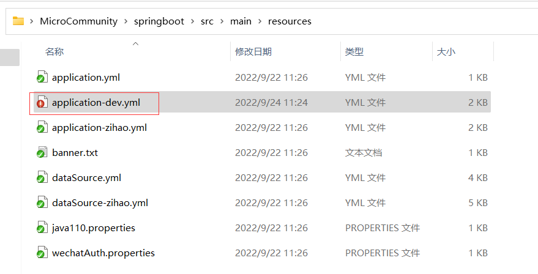

示例如下

```yaml
jedis:
  pool:
    config:
      maxTotal: 100
      maxIdle: 20
      maxWaitMillis: 20000
    host: 192.168.220.128
    port: 6379
    timeout: 3000
    password: 01star

# ......

spring:
  profiles:
    active: share
  http:
    encoding:
      charset: UTF-8
      enabled: true
      force: true
  application:
    name: boot-service
  redis:
    database: 0
    host: 192.168.220.128
    port: 6379
    password: 01star
    pool:
      max-active: 300
      max-wait: 10000
      max-idle: 100
      min-idle: 0
      timeout: 0

# ........
```

修改MySQL数据库配置

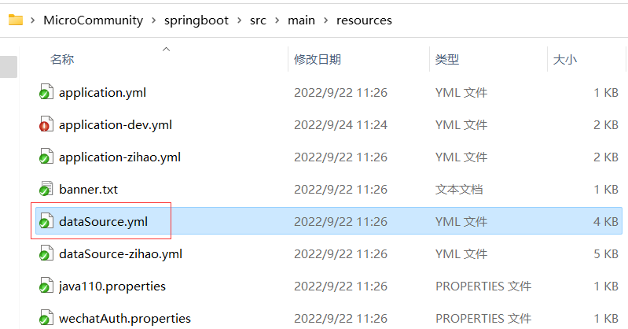

修改示例如下

```yaml
dataSources:
  ds0: !!com.alibaba.druid.pool.DruidDataSource
    driverClassName: com.mysql.cj.jdbc.Driver
    url: jdbc:mysql://192.168.220.128:3306/zosc_community?useUnicode=true&characterEncoding=utf-8&serverTimezone=GMT%2B8
    username: root
    password: 123456
    minIdle: 5
    validationQuery: SELECT 1 FROM DUAL
    initialSize: 5
    maxWait: 60000
    filters: stat,wall,log4j
    poolPreparedStatements: true
  ds1: !!com.alibaba.druid.pool.DruidDataSource
    driverClassName: com.mysql.cj.jdbc.Driver
    url: jdbc:mysql://192.168.220.128:3306/zosc_tt?useUnicode=true&characterEncoding=utf-8&serverTimezone=GMT%2B8
    username: root
    password: 123456
    minIdle: 5
    validationQuery: SELECT 1 FROM DUAL
    initialSize: 5
    maxWait: 60000
    filters: stat,wall,log4j
    poolPreparedStatements: true

# ........
```

### 2.3 编译项目

在后端项目根目录，依次执行下面的命令

`mvn clean install`

执行结果

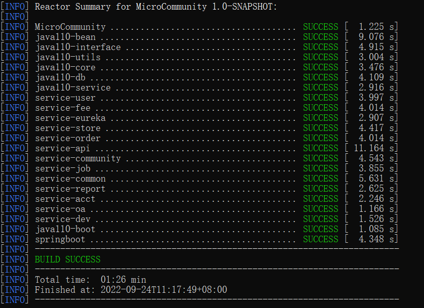

`mvn clean package`

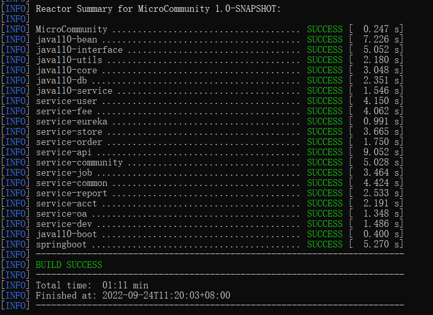

### 2.4 启动后端

执行下面的命令启动

```sh
java -jar springboot\target\MicroCommunityBoot.jar
```

等待启动，如果没有出现错误那么启动完成，启动完成如下图所示。

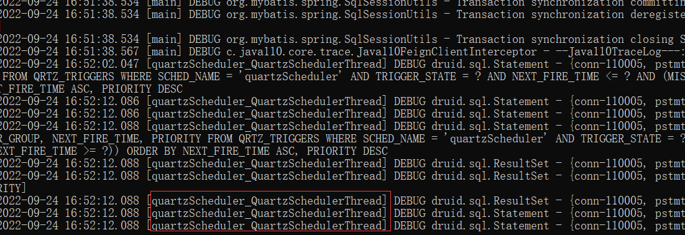

> **提示：**
>
> 服务器默认端口是8008。

> **注意：**
>
> jar的所有目录路径不能出现中文目录。

如果是已经打好的jar包，想要通过外部修改数据库配置，可以这样做。

修改Redis数据源，使用启动参数的方式修改，比如下面的命令重新指定了服务器端口和Redis数据源：

```java
java -jar springboot\target\MicroCommunityBoot.jar --server.port=8008 --jedis.pool.host=192.168.220.128 --jedis.pool.password=01star --spring.redis.host=192.168.220.128 --spring.redis.password=01star
```

修改MySQL数据源

使用压缩软件，将`dataSource.yml`提取出来，放到与jar同级目录，然后修改配置文件即可。

下图是配置文件在jar包中的位置

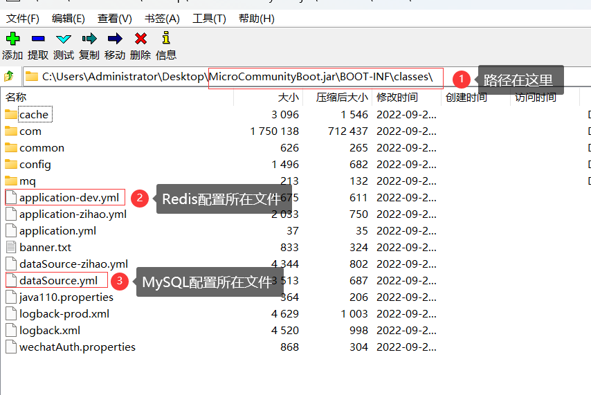

> **提示：**
>
> 要支持MySQL外部数据源需要修改源代码
>
> 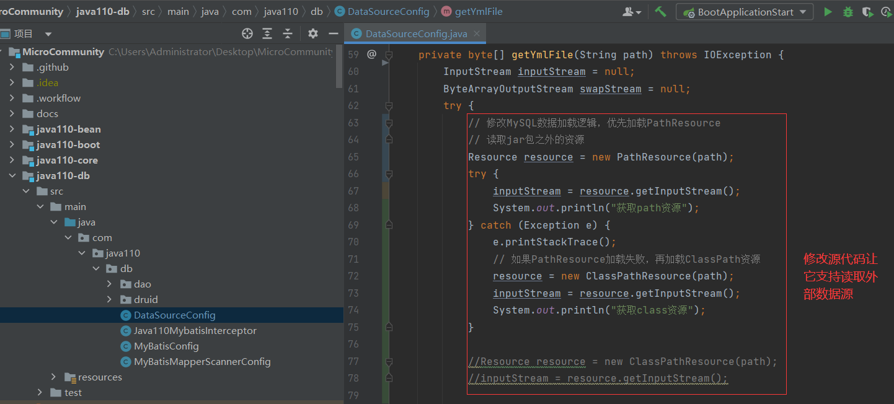

然后写个批处理文件用于启动项目

```powershell
java -jar MicroCommunityBoot.jar --server.port=8088 --jedis.pool.host=192.168.220.128 --jedis.pool.password=01star --spring.redis.host=192.168.220.128 --spring.redis.password=01star
pause
```

独立运行包目录结构如下图所示：

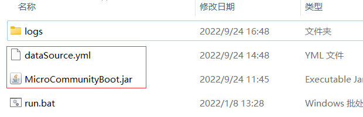

## 3 搭建前端

### 3.1 修改代码

修改app.js中后端地址为你服务器对应地址即可，比如

```js
//........
app.use('/callComponent', proxy('http://127.0.0.1:8008', opts));
app.use('/app', proxy('http://127.0.0.1:8008', opts));
app.use('/ws', createProxyMiddleware({
    target: 'http://127.0.0.1:8008',
    changeOrigin: true,
    ws: true
}));
//........
```

### 3.2 启动前端

首先删除node_modules目录，然后执行`npm install`重新安装依赖


然后执行命令`npm start`启动前端

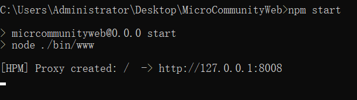

### 3.3 测试访问

访问地址为：http://localhost:3000，就会看到登录页面。


现在可以测试登录了，下面是账号：

- 管理员账号：admin/admin
- 物业演示账号：wuxw/admin
- 开发者账号：dev/密码自己修改 [如何修改](http://bbs.homecommunity.cn/pages/bbs/topic.html?topicId=102021110520080050)

### 3.4 打包前端项目

首先修改package.json

```json
{
  "name": "micrcommunityweb",
  "version": "0.0.0",
  "private": true,
  "main": "./bin/www",
  "bin": "./bin/www",
  "scripts": {
    "start": "node ./bin/www",
    "dev": "node ./bin/www"
  },
  "dependencies": {
    "cookie-parser": "~1.4.4",
    "debug": "~2.6.9",
    "express": "~4.16.1",
    "express-http-proxy": "^1.6.0",
    "http-errors": "~1.6.3",
    "jade": "^0.31.2",
    "morgan": "~1.9.1"
  },
  "devDependencies": {
    "http-proxy-middleware": "^1.0.1"
  },
  "pkg": {
	  "assets": ["views/**/*", "public/**/*","css/**/*","routes/**/*","bin/**/*"]
  }
}
```

安装打包工具，执行下面命令

```sh
npm install -g pkg
```

然后在前端项目的根目录执行打包指令，注意打包过程需要消耗一定的时间

```sh
pkg . -C GZip -t node16-win-x64
```

- -C：减小可执行文件大小，这里使用`GZip`压缩。
- -t：参数用于指定打包平台，这里只打包win平台，不指定所有平台都会打包。
  - 其他平台参数如下（node16表示使用node.js版本是16.x）:
  - node16-linux-x64
  - node16-macos-x64
  - node16-win-x64


更多选项，可以使用`--help`指令查看

```sh
pkg --help
```

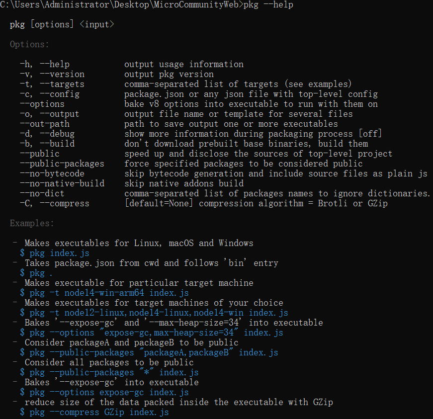

打包完成后，你可以在前端项目根目录看到一个可执行文件

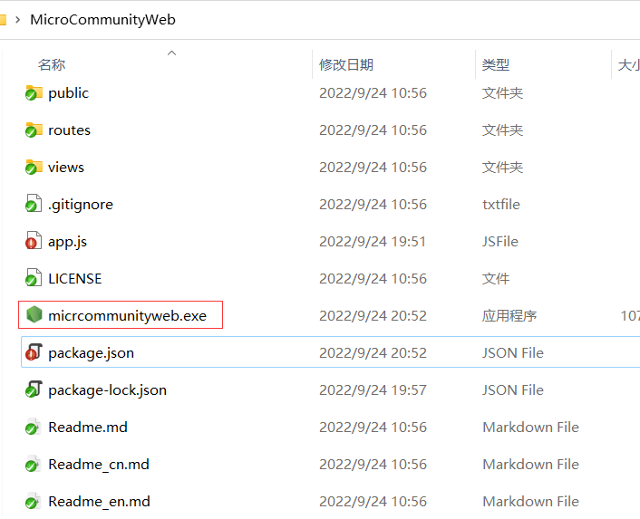

双击它你就可以启动前端了

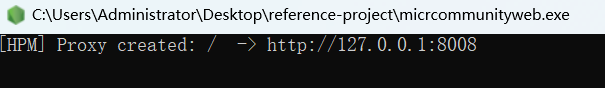
