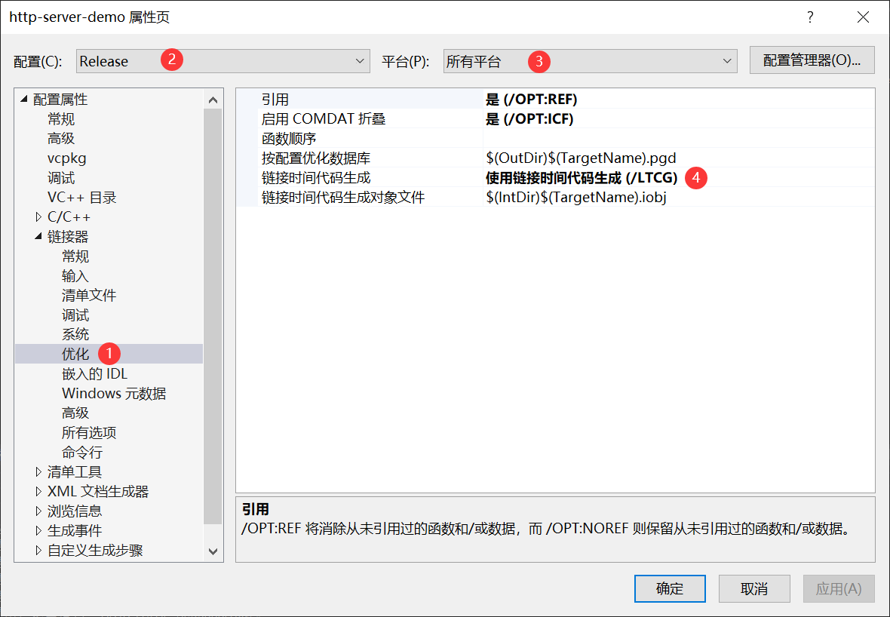

# `CPP`微服务架构

## 1 简介
构建一个带路由功能的HTTP微服务架构，支持`JSON`序列化，支持`MySQL`关系型数据库，支持`JWT`安全认证，支持`Nacos`服务注册与配置管理，支持消息中间件`Kafka`、`RocketMQ`，支持`FastDFS`分布式文件存储，支持`Redis`缓存数据库，支持`Excel`报表导入导出。

使用的时候需要引入静态库`http-lib、mysql-lib`、`common-lib`。

## 2 静态库目录规范

静态库项目包括如下几个主要的目录结构：

- `include`：存放第三方引入库的`h`或`hpp`文件，存放自己编写的`h`文件，方便使用静态库引用。
- `src`：存放`include`定义`h`的实现`cpp`资源文件。
- `lib / lib64`：用于存放第三方库编译的静态库。
- `pch.h / pch.cpp`：如果需要预编译标头，那么就需要定义。

## 3 动态库目录规范

动态库目录名称为`dy-lib`，里面主要包含程序执行需要的动态库文件，按照如下目录结构存放文件即可。

- `lib`
  - debug
  - release
- `lib64`
  - debug
  - release

## 4 软件架构

### 4.1 后端核心技术栈

|技术|说明|版本|备注|
|----|----|----|----|
|`cinatra`|`Http`框架|[d91b912bb6](https://github.com/qicosmos/cinatra/tree/d91b912bb63193eb2592732445ebf14c96e78180)|https://github.com/qicosmos/cinatra|
|`nlohmann/json`|`json`框架|[v3.10.5](https://github.com/nlohmann/json/releases/tag/v3.10.5)|https://github.com/nlohmann/json|
|`asio`|网络和低级I/O编程的跨平台C库|1.20.0|https://think-async.com/Asio/|
|`MySQL Connector`|`MySQL`连接驱动库| 8.0.27                                                  |https://dev.mysql.com/downloads/connector/cpp/<br>https://dev.mysql.com/doc/connector-cpp/1.1/en/connector-cpp-apps.html|
|`JWT`|`JSON` Web Token| [v1.4](https://github.com/arun11299/cpp-jwt/tree/v1.4) | https://opensourcelibs.com/lib/cpp-jwt |
| `OpenSSL` | 开源安全套接层协议 | `1.1.1L` | https://www.openssl.org/<br>https://www.xolphin.com/support/OpenSSL/OpenSSL_-_Installation_under_Windows |

### 4.2 后端扩展技术栈
|技术|说明|版本|备注|
|----|----|----|----|
| `xlnt` | excel报表 | 1.5.0 | https://github.com/tfussell/xlnt |
| `fastdfs` | 文件存储客户端 | latest | https://gitee.com/fastdfs100 |
| `yaml-cpp` | 解析`yaml`数据 | 0.7.0 | https://github.com/jbeder/yaml-cpp |
| `nacos` | `nacos`客户端 | `v1.1.0` | https://github.com/nacos-group/nacos-sdk-cpp |
| `redis++` | `redis`连接客户端 | 1.3.2 | https://github.com/sewenew/redis-plus-plus |
| `kafka` | `kafka`客户端 | 1.8.2 | https://github.com/edenhill/librdkafka/tree/v1.8.2 |
| `rocketmq` | `rokcetmq`客户端 | 2.1.0 | https://github.com/apache/rocketmq-client-cpp |


### 4.3 测试前端技术栈

|技术|说明|版本|备注|
|----|----|----|----|
|`jQuery`|Ajax框架|3.6.0|https://jquery.com/|
|`HTML5`|文本页面|5| https://www.w3schools.com/html/ |
| `CSS3` | 页面样式表 | 3 | https://www.w3schools.com/css/ |
| `JavaScript` | 页面小脚本 | `ES6` | https://www.w3schools.com/js/ |

## 5 环境搭建
### 5.1 参考链接

静态库：https://docs.microsoft.com/zh-cn/cpp/build/walkthrough-creating-and-using-a-static-library-cpp?view=msvc-160

标头：https://docs.microsoft.com/zh-cn/cpp/build/walkthrough-header-units?view=msvc-160

Linux：

- https://docs.microsoft.com/zh-cn/cpp/linux/download-install-and-setup-the-linux-development-workload?view=msvc-160

- ```sh
  yum -y install openssh-server gcc-c++ gdb cmake make ninja-build rsync zip unzip
  ```

### 5.2 开发工具

|工具|说明|版本|备注|
|----|----|----|----|
|`VS`|开发`IDE`|2019|https://docs.microsoft.com/en-us/visualstudio/releases/2019/release-notes|
|`Navicat`|数据库连接工具|latest|https://www.navicat.com.cn/|
|`Apipost`|`API`接口调试工具|latest|https://www.apipost.cn/|
|`Cmake`|跨平台编译工具|latest|https://cmake.org/cmake/help/latest/index.html|

### 5.3 开发环境

|软件系统|版本|备注|
|:---|----|----|
|Windows|10+|操作系统|
|`MySQL`|8|https://www.mysql.com/cn/|
|`Anolis OS`|8.6 GA|https://openanolis.cn/anolisos|

## 6 Windows平台项目搭建

克隆项目架构后，可以先使用`http-server-demo`项目进行测试，用于确认项目架构能否正常工作。

**TIP：** 

*如果在运行 `demo` 的时候出现找不到 `dll`文件错误，那么参考 **6.1.8.2** 对 `demo`的项目配置进行修改即可。*

接下来就需要在解决方案中，新增项目来完成你自己的业务功能。

创建完项目后可以使用`copy-resources.bat`工具复制`demo`中的关键代码到你的项目中。

新建项目中需要引入`http-lib`、`mysql-lib`、`common-lib`静态库以及对项目属性进行相应的配置。

接下我们来看看如何配置你的项目属性和编写关键代码。

***TIP：后续如果要想导入其他静态库，也可以参考下面的流程来完成。***

*如果在项目完成设置后，依然不能正常工作，可以对比`http-server-demo`的配置进行修正。*

### 6.1 项目属性设置

#### 6.1.1 引用模块

操作路径：项目右键->添加->引用，然后选择下图所示的模块。


#### 6.1.2 附加库目录

操作步骤示意图：


包含库目录内容如下：

```
.\
..\mysql-lib\include
..\http-lib\include
..\common-lib\include
```

#### 6.1.3 预编译头

设置使用预编译头，示意步骤如下图


下面是`stdafx.h`

```c++
// stdafx.h: 这是预编译标头文件。
// 下方列出的文件仅编译一次，提高了将来生成的生成性能。
// 这还将影响 IntelliSense 性能，包括代码完成和许多代码浏览功能。
// 但是，如果此处列出的文件中的任何一个在生成之间有更新，它们全部都将被重新编译。
// 请勿在此处添加要频繁更新的文件，这将使得性能优势无效。

#ifndef STDAFX_H
#define STDAFX_H

#ifndef LINUX

// 添加要在此处预编译的标头
#include "HttpLibMacros.h"
#include "asio.hpp"
#include "cinatra.hpp"
#include "jwt/jwt.hpp"
#include "mysql/jdbc.h"
#include "SqlSession.h"
#include "yaml-cpp/yaml.h"
#include "sw/redis++/redis++.h"

#endif // !LINUX

#endif //STDAFX_H
```

下面是`stdafx.cpp`

```c++
// stdafx.cpp: 与预编译标头对应的源文件

#include "stdafx.h"

// 当使用预编译的头时，需要使用此源文件，编译才能成功。
```

***注意：`stdafx.cpp`文件属性需要重新设置***


***注意：后面实现的  `cpp`  文件都需要在开头引入  `stdafx.h`***

#### 6.1.4 链接器——常规

##### 6.1.4.1 `Win32`平台

`Win32-Debug`配置操作步骤如下图所示


附加库目录内容如下：

```
..\http-lib\lib\openssl
..\common-lib\lib\debug
..\mysql-lib\lib\vs14\debug
```

`Win32-Release`配置操作步骤如下图所示


附加库目录内容如下：

```
..\http-lib\lib\openssl
..\common-lib\lib
..\mysql-lib\lib\vs14
```

##### 6.1.4.2 `x64`平台

`x64-Debug`配置操作步骤如下图所示


附加库目录内容如下：

```
..\http-lib\lib64\openssl
..\common-lib\lib64\debug
..\mysql-lib\lib64\vs14\debug
```

`x64-Release`配置操作步骤如下图所示


附加库目录内容如下：

```
..\http-lib\lib64\openssl
..\common-lib\lib64
..\mysql-lib\lib64\vs14
```

#### 6.1.5 链接器——输入

##### 6.1.5.1 Debug模式

配置操作步骤如下图所示


静态库内容如下：

```sh
# 必选库
mysqlcppconn.lib
libcrypto.lib
libssl.lib
# 下面是可选库，如果需要对应功能再选择
# excel库
xlntd.lib
# yaml配置解析库
yaml-cppd.lib
# redis库
hiredis.lib
redis++.lib
# kafka消息中间件库
rdkafka++.lib
# rocket消息中间件库
rocketmq-client-cpp.lib
```

##### 6.1.5.2 Release模式

配置操作步骤如下图所示


静态库内容如下：

```sh
# 必选库
mysqlcppconn.lib
libcrypto.lib
libssl.lib
# 下面是可选库，如果需要对应功能再选择
# excel库
xlnt.lib
# yaml配置解析库
yaml-cpp.lib
# redis库
hiredis.lib
redis++.lib
# kafka消息中间件库
rdkafka++.lib
# rocket消息中间件库
rocketmq-client-cpp.lib
```

#### 6.1.6 链接器——优化



#### 6.1.7 设置语言版本


#### 6.1.8 设置动态链接库路径

##### 6.1.8.1 Release模式

Release模式下是进行`dll`文件复制，下面是复制指令：

```sh
xcopy "$(SolutionDir)dy-lib/lib/release" "$(OutDir)" /a /F /I /Y /C
```

`Win32`平台


`x64`平台


##### 6.1.8.2 Debug模式

Debug模式下为了加快启动效率，使用添加环境变量的方式。

***注意：***

***1.环境变量配置方式属于用户级配置，clone项目的每个客户端都需要再配置一次。***

***2.环境变量配置方式可能和系统中有的动态库冲突，如果冲突那么请手动复制 `dll` 到 `exe` 同级目录。***

下面是设置环境变量参考值：

```sh
path=%path%;../dy-lib/lib/debug
```

`Win32`平台


`x64`平台


### 6.2 关键代码

#### 6.2.1 程序入口

`main.cpp`中可以使用下列代码来启动服务器。

```c++
#include "stdafx.h"
#include "HttpServer.h"
#include "DbInit.h"

int main() {
    //初始数据库连接
    DbInit::initDbPool(
        DBConfig("root", "123456", "test", "192.168.220.128", 3306, 25));
    //启动HTTP服务器
	int code = HttpServer::startServer("8090",
		[](http_server* server) {
			//设置路由，可以参考Router的实现
		}
	);
	//释放数据库连接
	DbInit::releasePool();
	return code;
}
```

#### 6.2.2 实现切面

在`http-lib` 模块定义一个切面（`api/Aspect.h`）需要在引用模块来实现。

```c++
#include "stdafx.h"
#include "api/Aspect.h"

bool CROS::before(request& req, response& res)
{
	res.add_header("Access-Control-Allow-Origin", "*");
	res.add_header("Access-Control-Allow-Methods", "*");
	res.add_header("Access-Control-Expose-Headers", "*");
	//允许携带cookie凭证
	res.add_header("Access-Control-Allow-Credentials", "true");
	res.add_header("Access-Control-Allow-Headers", "Content-Type,Access-Token");
	if (req.get_method() == "OPTIONS") {
		res.set_status_and_content(status_type::ok);
		return false;
	}
	return true;
}

bool Check::before(request& req, response& res)
{
    //在这里来验证请求是否已经通过授权
	std::cout << "before check" << std::endl;
	return true;
}

bool Check::after(request& req, response& res)
{
	std::cout << "after check" << std::endl;
	return true;
}
```

***TIP:完整的切面实现可以参考Demo中实现，其中实现了凭证验证功能，可以直接复用。***

#### 6.2.3 使用启动参数

定义一个服务器信息类，用于存储服务器信息，参考代码如下

```cpp
#ifndef _SEVERCONFIGINFO_H_
#define _SEVERCONFIGINFO_H_
#include "Macros.h"
#include <string>
class ServerInfo
{
	// 定义单例
	DECLARE_INSTANCE(ServerInfo);
	// 服务器端口
	CC_SYNTHESIZE(std::string, serverPort, ServerPort);
	// Nacos配置参数
	CC_SYNTHESIZE(std::string, nacosAddr, NacosAddr);
	CC_SYNTHESIZE(std::string, nacosNs, NacosNs);
	CC_SYNTHESIZE(std::string, regIp, RegIp);
	CC_SYNTHESIZE(std::string, serviceName, ServiceName);
	// 数据库连接信息
	CC_SYNTHESIZE(std::string, dbUsername, DbUsername);
	CC_SYNTHESIZE(std::string, dbPassword, DbPassword);
	CC_SYNTHESIZE(std::string, dbName, DbName);
	CC_SYNTHESIZE(std::string, dbHost, DbHost);
	CC_SYNTHESIZE(int, dbPort, DbPort);
	CC_SYNTHESIZE(int, dbMax, DbMax);
};
#endif // _SEVERCONFIGINFO_H_
```

通过启动参数设定服务器，方便部署服务器。

```c++
#include "stdafx.h"
#include "HttpServer.h"
#include "DbInit.h"
#include "api/Router.h"
#include "ServerInfo.h"
#include "StringUtil.h"

/**
 * 解析启动参数
 * 注意：
 * 参数中数据需要满足一定的格式，如：sp=8090、sn=feign-cpp-sample
 * 前缀与真实值之间使用=分隔
 */
bool getStartArg(int argc, char* argv[]) {
	// 服务器端口
	std::string serverPort = "8090";
	// 数据库连接信息
	std::string dbUsername = "root";
	std::string dbPassword = "123456";
	std::string dbName = "test";
	std::string dbHost = "192.168.220.128";
	int dbPort = 3306;
	int dbMax = 25;
    
	// 开始解析
	int currIndex = 1;
	bool isSetDb = false;
	while (currIndex < argc)
	{
		// 拆分字符串
		auto args = StringUtil::split(argv[currIndex], "=");
		// 判断参数是否合法
		if (args.size() != 2) {
			cout << "arg: " << argv[currIndex] << ", format error." << endl;
			exit(1);
		}

		// 根据参数前缀对不同属性复制
		std::string prefix = args[0];
		std::string val = args[1];
		if (prefix == "sp") serverPort = val;
		else if (prefix == "du") {
			isSetDb = true;
			dbUsername = val;
		}
		else if (prefix == "dp") {
			isSetDb = true;
			dbPassword = val;
		}
		else if (prefix == "dn") {
			isSetDb = true;
			dbName = val;
		}
		else if (prefix == "dh") {
			isSetDb = true;
			dbHost = val;
		}
		else if (prefix == "dP") {
			isSetDb = true;
			dbPort = atoi(val.c_str());
		}
		else if (prefix == "dm") dbMax = atoi(val.c_str());
		// 更新索引
		currIndex++;
	}

	// 记录服务器配置到内存中方便使用
	ServerInfo::getInstance().setServerPort(serverPort);
	ServerInfo::getInstance().setDbUsername(dbUsername);
	ServerInfo::getInstance().setDbPassword(dbPassword);
	ServerInfo::getInstance().setDbName(dbName);
	ServerInfo::getInstance().setDbHost(dbHost);
	ServerInfo::getInstance().setDbPort(dbPort);
	ServerInfo::getInstance().setDbMax(dbMax);
	return isSetDb;
}

int main(int argc, char* argv[]) {
	// 服务器参数初始化
	bool isSetDb = getStartArg(argc, argv);
	// 初始数据库连接
	DbInit::initDbPool(DBConfig(
		ServerInfo::getInstance().getDbUsername(), 
		ServerInfo::getInstance().getDbPassword(), 
		ServerInfo::getInstance().getDbName(),
		ServerInfo::getInstance().getDbHost(),
		ServerInfo::getInstance().getDbPort(), 
		ServerInfo::getInstance().getDbMax()));
	// 启动HTTP服务器
	int code = HttpServer::startServer(ServerInfo::getInstance().getServerPort(),
		[=](http_server* server) {
			Router router(server);
			router.initRouter();
		}
	);
	// 释放数据库连接
	DbInit::releasePool();
	return code;
}
```

所有启动参数说明：

```sh
"na: nacos server host and port. example na=39.99.114.126:8848"
"ns: nacos server namespace. example ns=1653f775-4782-46ad-9cd2-b60155a574c6"
"ip: register ip. example ip=192.168.220.128"
"sn: register service name. example sn=feign-cpp-sample"
"sp: server port. example sp=8090"
"du: mysql database username. example du=root"
"dp: mysql database password. example dp=123456"
"dn: mysql database dbname. example dn=test"
"dh: mysql database host. example dh=192.168.220.128"
"dP: mysql database port. example dP=3306"
"dm: mysql database pool maxsize. example dm=25"
```

## 7 Linux平台项目搭建

### 7.1 参考链接

#### 7.1.1 `VS CMake`

VS中使用`CMake`参考下面的链接：

https://docs.microsoft.com/zh-cn/cpp/build/cmake-projects-in-visual-studio?view=msvc-170&viewFallbackFrom=vs-2019

除了完成 **5.1** 中Linux配置外，为了保证在编译时正常链接程序所需要的库，需要补充安装下列软件包：

```sh
yum -y install uuid uuid-devel libuuid libuuid-devel
yum -y install openssl-devel libcurl-devel
```

#### 7.1.2 `openssl`版本升级

当你启动编译后的可执行文件出现下面的错误

```sh
./http-server-demo-mk: error while loading shared libraries: libssl.so.1.1: cannot open shared object file: No such file or directory
```

可以参考这个链接进行修复：https://blog.csdn.net/estelle_belle/article/details/111181037

### 7.2 编译配置

#### 7.2.1 项目模块

你只需要在windows项目模块根目录书写一个`CMakeLists.txt`文件即可，下面是参考配置。

你可以复制一份demo里面的`CmakeLists.txt`文件到你的项目模块加以修改即可。

```cmake
# CMakeList.txt: http-server-demo-mk 的 CMake 项目，在此处包括源代码并定义
# 项目特定的逻辑。
#
cmake_minimum_required (VERSION 3.8)

# 设置文件名称
# 【需要修改】：修改成你自己对应的项目名称
set (appName http-server-demo-mk)

# 包含库目录
include_directories ("./")
include_directories ("../http-lib/include")
include_directories ("../mysql-lib/include")
include_directories ("../common-lib/include")

# 链接库路径，程序运行的时候也在这里找
link_directories (${PROJECT_BINARY_DIR}/http-lib)
link_directories (${PROJECT_BINARY_DIR}/mysql-lib)
link_directories (${PROJECT_BINARY_DIR}/common-lib)
link_directories (${PROJECT_SOURCE_DIR}/common-lib/lib64)
link_directories (${PROJECT_SOURCE_DIR}/dy-lib/lib64)

# 将源代码添加到此项目的可执行文件
file (GLOB_RECURSE SC_FILES ./*.cpp)

# 编译可执行文件
add_executable (${appName} ${SC_FILES})

# 链接库
target_link_libraries (${appName} "common-lib" "http-lib" "mysql-lib")

# 链接其他库依赖库，如：你要链接libuuid直接写成uuid
target_link_libraries (${appName} uuid pthread stdc++fs OpenSSL::SSL )
target_link_libraries (${appName} mysqlcppconn )
# 链接xlnt
if(USE_XLNT)
	target_link_libraries (${appName} xlnt )
	message (STATUS "${appName}: link xlnt lib")
endif()
# 链接fastdfs
if(USE_DFS)
	target_link_libraries (${appName} fdfsclient fastcommon )
	message (STATUS "${appName}: link fdfsclient lib")
endif()
# 链接ymal
if(USE_YML)
	target_link_libraries (${appName} yaml-cpp )
	message (STATUS "${appName}: link yamlcpp lib")
endif()
# 链接nacos
if(USE_NACOS)
	target_link_libraries (${appName} nacos-cli )
	message (STATUS "${appName}: link nacos lib")
endif()
# 链接redis
if(USE_REDIS)
	target_link_libraries (${appName} redis++ hiredis )
	message (STATUS "${appName}: link redis lib")
endif()
# 链接Kafka
if(USE_KAFKA)
	target_link_libraries (${appName} rdkafka++ rdkafka )
	message (STATUS "${appName}: link kakfa lib")
endif()
# 链接RocketMQ
if(USE_ROCKETMQ)
	target_link_libraries (${appName} rocketmq )
	message (STATUS "${appName}: link rocketmq lib")
endif()

# 复制配置到调试时可执行文件所在的目录
# RSA公钥证书
file (COPY "public.pem" DESTINATION ${PROJECT_BINARY_DIR}/${appName})
# FastDFS配置文件
file (GLOB fdfsConf "../common-lib/include/fastdfs/conf/*")
file (COPY ${fdfsConf} DESTINATION ${PROJECT_BINARY_DIR}/${appName}/conf)

# 安装文件
# 可执行文件
install (TARGETS ${appName} RUNTIME DESTINATION ${appName})
# RSA公钥证书
install (FILES "public.pem" DESTINATION ${appName})
# FastDFS配置文件
install (DIRECTORY "${PROJECT_SOURCE_DIR}/common-lib/include/fastdfs/conf" DESTINATION ${appName})
# 第三方动态链接库
install (DIRECTORY "${PROJECT_SOURCE_DIR}/dy-lib/lib64/" DESTINATION lib FILES_MATCHING PATTERN "*.so*")
# 启动脚本
install (PROGRAMS ${PROJECT_SOURCE_DIR}/run-front.sh ${PROJECT_SOURCE_DIR}/run-back.sh DESTINATION ${appName})
```

#### 7.2.2 全局配置

除此之外，还需要修改解决方案中的`CMakeLists.txt`，包含你的项目模块目录，参考如下：

```cmake
# CMakeList.txt: 顶层 CMake 项目文件，在此处执行全局配置
# 并包含子项目。
#
cmake_minimum_required (VERSION 3.8)

# 指定工程名
project ("zero-one-star-cpp-proj")

# 设置安装目录前缀
set (CMAKE_INSTALL_PREFIX "/home/${PROJECT_NAME}" CACHE PATH "install path prefix" FORCE )

# C++标准
set (CMAKE_CXX_STANDARD 17)
set (CMAKE_CXX_STANDARD_REQUIRED ON)

# 添加宏定义
add_definitions(-DLINUX)
add_definitions(-D_CRT_SECURE_NO_WARNINGS -D_SILENCE_ALL_CXX17_DEPRECATION_WARNINGS )
add_definitions(-DASIO_STANDALONE )
add_definitions(-DCHECK_TOKEN)
add_definitions(-DSTOP_PWD="01star")

# 在camke .. 的时候会输出提示目录路径
message (STATUS "Prefix dir is ${CMAKE_INSTALL_PREFIX}")
message (STATUS "Binary dir is ${PROJECT_BINARY_DIR}")
message (STATUS "Source dir is ${PROJECT_SOURCE_DIR}")

# 检查OpenSSL库是否存在
find_package (OpenSSL REQUIRED)
if(OPENSSL_FOUND)
  include_directories (${OPENSSL_INCLUDE_DIRS})
  message (STATUS "OpenSSL Found!")
endif()

# 设置宏定义开关
# 【需要修改】：根据你的需要选用组件
option (USE_XLNT "use xlnt" ON)
option (USE_DFS "use fastdfs" ON)
option (USE_YML "use yaml" ON)
option (USE_NACOS "use nacos, need open yaml" ON)
option (USE_REDIS "use redis" ON)
option (USE_KAFKA "use kafka" OFF)
option (USE_ROCKETMQ "use rocketmq" ON)

# 选项宏定义
# 为了保证排除后编译通过，在单独使用这些库的地方加上对应的宏定义
if (USE_XLNT)
	add_definitions(-DUSE_XLNT)
endif()
if (USE_DFS)
	add_definitions(-DUSE_DFS)
endif()
if (USE_YML)
	add_definitions(-DUSE_YML)
endif()
if (USE_NACOS)
	add_definitions(-DUSE_NACOS)
endif()
if (USE_REDIS)
	add_definitions(-DUSE_REDIS)
endif()
if (USE_KAFKA)
	add_definitions(-DUSE_KAFKA)
endif()
if (USE_ROCKETMQ)
	add_definitions(-DUSE_ROCKETMQ)
endif()

# 包含子项目
# 【需要修改】：在结尾处添加你新建项目模块
add_subdirectory ("http-lib")
add_subdirectory ("mysql-lib")
add_subdirectory ("common-lib")
# 这是示例模块，后期可以不编译它
add_subdirectory ("http-server-demo-mk")
```

#### 7.2.3 `VS Cmake`配置参考

需要忽略不需要复制到Linux服务器的文件，下面是参考配置。

```json
{
  "configurations": [
    {
      "name": "Linux-GCC-Debug",
      "generator": "Ninja",
      "configurationType": "Debug",
      "cmakeExecutable": "cmake",
      "remoteCopySourcesExclusionList": [ ".vs", ".git", "out", "[Dd]ebug", "[Rr]elease", "x64", "imgs", "*.lib", "*.dll", "*.vcxproj*", "*.md", "*.sln" ],
      "cmakeCommandArgs": "",
      "buildCommandArgs": "",
      "ctestCommandArgs": "",
      "inheritEnvironments": [ "linux_x64" ],
      "remoteMachineName": "${defaultRemoteMachineName}",
      "remoteCMakeListsRoot": "$HOME/.vs/${projectDirName}/${workspaceHash}/src",
      "remoteBuildRoot": "$HOME/.vs/${projectDirName}/${workspaceHash}/out/build/${name}",
      "remoteInstallRoot": "$HOME/.vs/${projectDirName}/${workspaceHash}/out/install/${name}",
      "remoteCopySources": true,
      "rsyncCommandArgs": "-t --delete --delete-excluded",
      "remoteCopyBuildOutput": false,
      "remoteCopySourcesMethod": "rsync"
    }
  ]
}
```

### 7.3 启动与停止服务

前台启动指令参考

```sh
./http-server-demo-mk sp=8091 du=root ...
# 其中...表示其它启动参数配置，根据你的需要增加即可
```

后台启动指令参考

```sh
nohup ./http-server-demo-mk sp=8091 du=root ... >logs.log 2>&1 &
# 其中...表示其它启动参数配置，根据你的需要增加即可
```

停止服务参考指令

```sh
curl http://ip:port/system-kill/密码
# 如: curl http://127.0.0.1:8091/system-kill/01star
```

**TIP**：

*启动如果提示找不到相应的动态库，请将可执行文件同级目录下面的 `lib64` 目录下面的所有 `.so` 文件上传到目标服务器的 `/usr/lib64` 目录下面。*

使用`make install`指令安装后的可执行文件，可以使用shell脚本启动服务，下面是使用示例。

```sh
# 前台启动
./run-front.sh http-server-demo-mk sp=8090 du=root ...
# 后台启动
./run-back.sh http-server-demo-mk sp=8090 du=root ...
```

### 7.4 支持`Nacos`

#### 7.4.1 编译配置

```cmake
# 保证你的编译配置中包含有nacos-cli和yaml-cpp
target_link_libraries (${appName} nacos-cli yaml-cpp )
```

#### 7.4.2 程序入口修改

```cpp
#include "stdafx.h"
#include "HttpServer.h"
#include "DbInit.h"
#include "api/Router.h"
#include "ServerInfo.h"
#include "StringUtil.h"
// 导入Nacos需要用到的头文件
#ifdef USE_NACOS
#include "NacosClient.h"
#include "YamlHelper.h"
#endif

/**
 * 解析启动参数
 * 注意：
 * 参数中数据需要满足一定的格式，如：sp=8090、sn=feign-cpp-sample
 * 前缀与真实值之间使用=分隔
 */
bool getStartArg(int argc, char* argv[]) {
	// 服务器端口
	std::string serverPort = "8090";
	// 数据库连接信息
	std::string dbUsername = "root";
	std::string dbPassword = "123456";
	std::string dbName = "test";
	std::string dbHost = "192.168.220.128";
	int dbPort = 3306;
	int dbMax = 25;
#ifdef USE_NACOS
	// Nacos配置参数
	std::string nacosAddr = "39.99.114.126:8848";
	std::string nacosNs = "1653f775-4782-46ad-9cd2-b60155a574c6";
	std::string serviceName = "feign-cpp-sample";
	std::string regIp = "192.168.220.128";
#endif

	// 开始解析
	int currIndex = 1;
	bool isSetDb = false;
	while (currIndex < argc)
	{
		// 拆分字符串
		auto args = StringUtil::split(argv[currIndex], "=");
		// 判断参数是否合法
		if (args.size() != 2) {
			cout << "arg: " << argv[currIndex] << ", format error." << endl;
			exit(1);
		}

		// 根据参数前缀对不同属性复制
		std::string prefix = args[0];
		std::string val = args[1];
		if (prefix == "sp") serverPort = val;
		else if (prefix == "du") {
			isSetDb = true;
			dbUsername = val;
		}
		else if (prefix == "dp") {
			isSetDb = true;
			dbPassword = val;
		}
		else if (prefix == "dn") {
			isSetDb = true;
			dbName = val;
		}
		else if (prefix == "dh") {
			isSetDb = true;
			dbHost = val;
		}
		else if (prefix == "dP") {
			isSetDb = true;
			dbPort = atoi(val.c_str());
		}
		else if (prefix == "dm") dbMax = atoi(val.c_str());
#ifdef USE_NACOS
		else if (prefix == "na") nacosAddr = val;
		else if (prefix == "ns") nacosNs = val;
		else if (prefix == "sn") serviceName = val;
		else if (prefix == "ip") regIp = val;
#endif
		// 更新索引
		currIndex++;
	}

	// 记录服务器配置到内存中方便使用
	ServerInfo::getInstance().setServerPort(serverPort);
	ServerInfo::getInstance().setDbUsername(dbUsername);
	ServerInfo::getInstance().setDbPassword(dbPassword);
	ServerInfo::getInstance().setDbName(dbName);
	ServerInfo::getInstance().setDbHost(dbHost);
	ServerInfo::getInstance().setDbPort(dbPort);
	ServerInfo::getInstance().setDbMax(dbMax);
#ifdef USE_NACOS
	ServerInfo::getInstance().setNacosAddr(nacosAddr);
	ServerInfo::getInstance().setNacosNs(nacosNs);
	ServerInfo::getInstance().setRegIp(regIp);
	ServerInfo::getInstance().setServiceName(serviceName);
#endif
	return isSetDb;
}

int main(int argc, char* argv[]) {
	// 服务器参数初始化
	bool isSetDb = getStartArg(argc, argv);
#ifdef USE_NACOS
	// 创建Nacos客户端对象
	NacosClient nacosClient(
		ServerInfo::getInstance().getNacosAddr(), 
		ServerInfo::getInstance().getNacosNs());
	// 从Nacos配置中心中获取数据库配置
	if (!isSetDb)
	{
#ifdef LINUX
		YAML::Node node = nacosClient.getConfig("data-source.yaml");
#else
		YAML::Node node = nacosClient.getConfig("./conf/data-source.yaml");
#endif
		YamlHelper yaml;
		int dbPort = 0;
		std::string dbHost = "";
		std::string dbName = "";
		// 解析数据库连接字符串
		std::string dbUrl = yaml.getString(node, "spring.datasource.url");
		yaml.parseDbConnUrl(dbUrl, dbHost, dbPort, dbName);
		// 获取数据库用户名和密码
		std::string dbUsername = yaml.getString(node, "spring.datasource.username");
		std::string dbPassword = yaml.getString(node, "spring.datasource.password");
		// 重新修改缓存中的数据
		ServerInfo::getInstance().setDbUsername(dbUsername);
		ServerInfo::getInstance().setDbPassword(dbPassword);
		ServerInfo::getInstance().setDbName(dbName);
		ServerInfo::getInstance().setDbHost(dbHost);
		ServerInfo::getInstance().setDbPort(dbPort);
	}
	// 注册服务
	nacosClient.registerInstance(
		ServerInfo::getInstance().getRegIp(), 
		atoi(ServerInfo::getInstance().getServerPort().c_str()),
		ServerInfo::getInstance().getServiceName());
#endif
	
	// 初始数据库连接
	DbInit::initDbPool(DBConfig(
		ServerInfo::getInstance().getDbUsername(), 
		ServerInfo::getInstance().getDbPassword(), 
		ServerInfo::getInstance().getDbName(),
		ServerInfo::getInstance().getDbHost(),
		ServerInfo::getInstance().getDbPort(), 
		ServerInfo::getInstance().getDbMax()));
	// 启动HTTP服务器
	int code = HttpServer::startServer(ServerInfo::getInstance().getServerPort(),
		[=](http_server* server) {
			Router router(server);
			router.initRouter();
		}
	);
	// 释放数据库连接
	DbInit::releasePool();

#ifdef USE_NACOS
	// 反注册服务
	nacosClient.deregisterInstance(
		ServerInfo::getInstance().getRegIp(),
		atoi(ServerInfo::getInstance().getServerPort().c_str()),
		ServerInfo::getInstance().getServiceName());
#endif
	return code;
}
```

