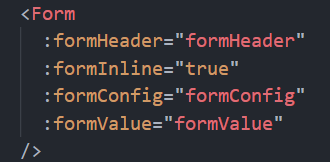
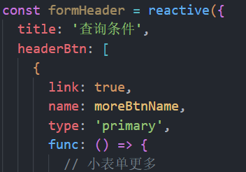
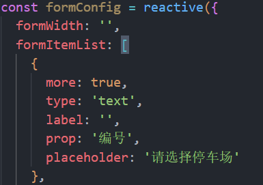
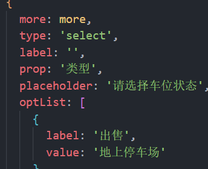
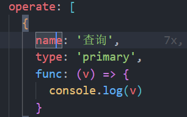

## 表单组件使用规范

引用

1. formHeader 表单标题
   title--标题名称，headerBtn--有则存在按钮；
   headerBtn: [
   name--按钮名称，
   type--按钮类型，
   link--是否设置链接的样式，true则设置
   func--点击按钮后需执行的方法
   ]
   
2. formInline  控制表单元素一行显示，true则行排满后再下一行，一般用在小表单上
3. formConfig 表单内容
   formWidth--表单宽度（暂不设置，预备为大表单使用，设置不一样的样式宽度）

   formItemList--表单内容项   [
   more--一直显示则设为true，点击更多后再显示则设为写more,
   type--表单内容项类型 text为标准输入框，select为选择框
   label--表单项标签
   prop--值的名称
   placeholder--未输入时显示的内容
   若是select类型则加 optList:[] 表示选择项
   ]；
   operate表示按钮，内容意义如上

   
4. 表单内容
   formValue--初始值，小表单默认为空，若为大表单则接收表格或其他传来的数据
