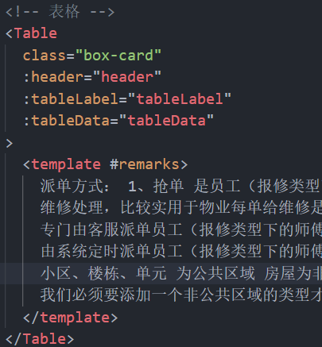
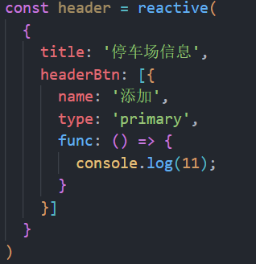
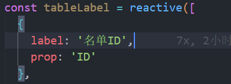
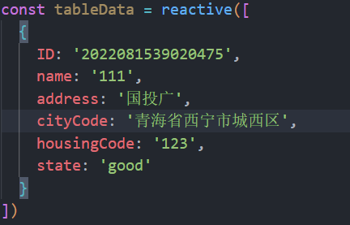

## Table 传入组件数据规范说明

引用

1. header   表格头部  对象类型

   title 属性为表格标题名称，  headerBtn若存在则显示标题右侧按钮（name为按钮名称，type为按钮类型，func为点击后执行的方法）

   示例：

2. tableLabel   表格标签  数组类型

* labelList为表格栏设置，label属性为表头栏名称，prop表示与label对应的后端数据名称， btn 若存在则显示操作按钮 （name为按钮名称，type为按钮类型，func为点击后执行的方法）
* 实例：

3. tableData   表格数据  对象数组

  从后端接收即可

   当前模拟格式为

注：：

父组件都要写下面代码，控制小表单的更多

constmore=ref(false)

constmoreBtnName=ref('更多')

以及"更多"按钮功能里写

    more.value=!more.value

    if (more.value) {

    moreBtnName.value='隐藏'

    } else {

    moreBtnName.value='更多'

    }
